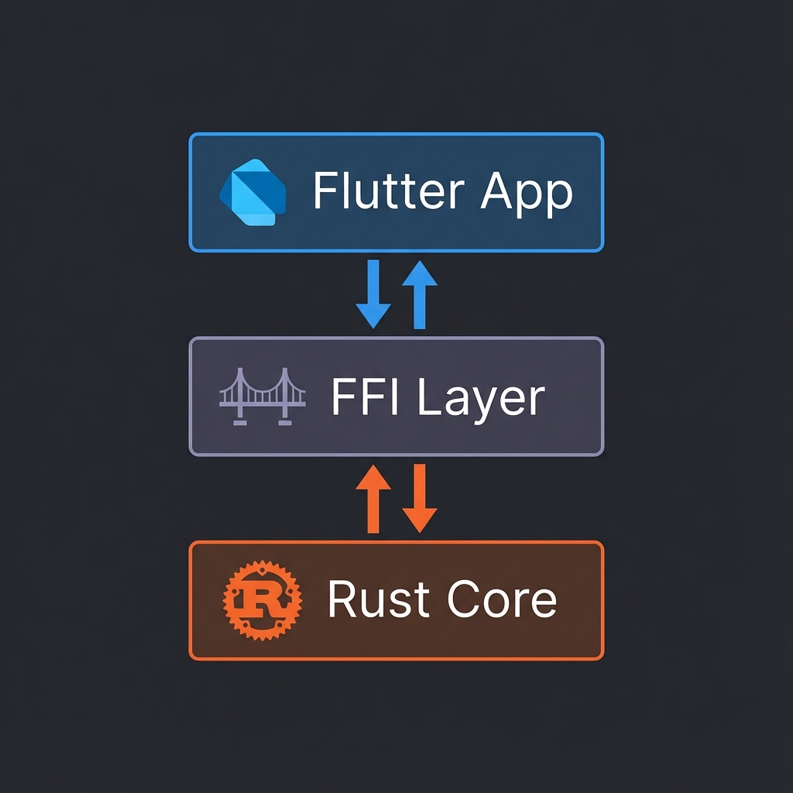
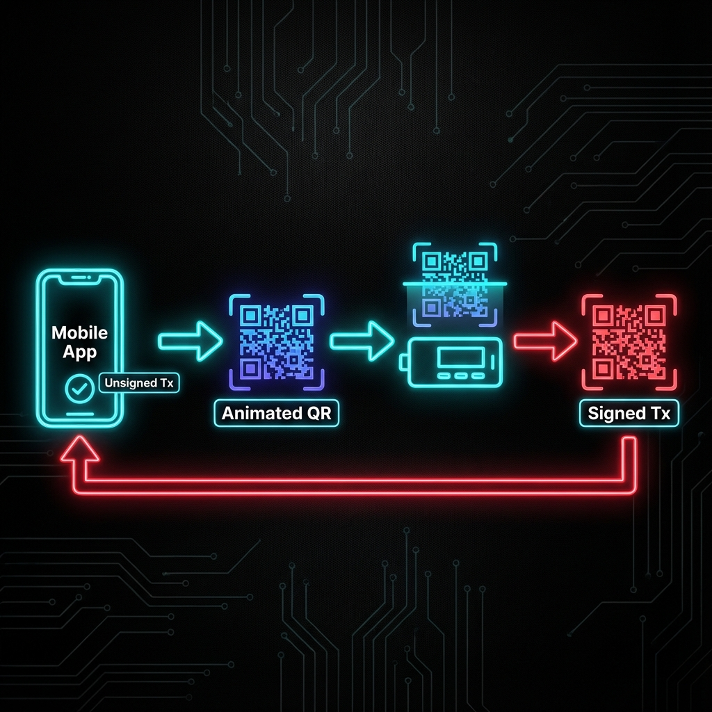

# UR Registry Rust - TRON Support

[](https://opensource.org/licenses/MIT)
[](https://developer.android.com/studio)
[](https://flutter.dev)

> **A specialized fork of [KeystoneHQ/ur-registry-rust](https://github.com/KeystoneHQ/ur-registry-rust) enabling TRON blockchain support for air-gapped hardware wallets.**

---

## 🚀 Overview

The original UR Registry implementation supports Bitcoin, Ethereum, Solana, and Cardano. This fork extends that capability to the **TRON ecosystem**, allowing secure, air-gapped transaction signing via animated QR codes (BC-UR).

### ✨ Key Features

*   **TRON Sign Request**: `tron-sign-request` UR type for transaction signing requests.
*   **TRON Signature**: `tron-signature` UR type for signed transaction responses.
*   **Cross-Platform Support**: Full Flutter/Dart bindings and Rust FFI layer.
*   **Pre-compiled Binaries**: Ready-to-use Android libraries (`arm64-v8a`, `armeabi-v7a`).

---

## 🏗 Architecture

This project bridges the gap between high-level mobile applications (Flutter) and low-level cryptographic operations (Rust) using a robust FFI layer.



1.  **Flutter App**: Handles UI and user interaction.
2.  **FFI Layer**: Marshals data between Dart and Rust.
3.  **Rust Core**: Performs efficient CBOR encoding/decoding and cryptographic operations.

---

## 🔄 Signing Flow

The secure signing process involves a defined lifecycle of data exchange between the software wallet (Hot) and the hardware wallet (Cold).



1.  **App**: Constructs an unsigned TRON transaction.
2.  **App**: Encodes the transaction into a `tron-sign-request` UR and displays it as a QR code.
3.  **Hardware Wallet**: Scans the QR code, decodes the request, and signs the transaction.
4.  **Hardware Wallet**: Encodes the signature into a `tron-signature` UR and displays it as a QR code.
5.  **App**: Scans the response, extracts the signature, and broadcasts the transaction.

---

## 📦 Usage

### 1. Creating a Sign Request (Flutter)

Construct a request to send to the hardware wallet.

```dart
import 'package:ur_registry_flutter/registries/tron/tron_sign_request.dart';

// Create the request
final request = TronSignRequest.factory(
  signData: unsignedTxBytes,       // Raw transaction bytes
  path: "m/44'/195'/0'/0/0",       // Derivation path
  xfp: "12345678",                 // Master Fingerprint
  address: "TRxxx...",             // TRON Address
  origin: "TRON MultiSig Wallet",  // Originating app name
  dataType: TronSignRequest.transaction,
);

// Get the UR encoder to display as an animated QR code
final urEncoder = request.toUREncoder();
String qrData = urEncoder.nextPart();
```

### 2. Parsing the Signature

Handle the response from the hardware wallet.

```dart
import 'package:ur_registry_flutter/registries/tron/tron_signature.dart';

void onScanSuccess(NativeObject object) {
  if (object is TronSignature) {
    final signature = object.getSignature(); // Hex string of the signature
    final requestId = object.getRequestId(); // UUID to match request
    
    print("Received Signature: $signature");
  }
}
```

---

## 🛠 Build & Installation

### Prerequisites
*   Android NDK 27.x or later
*   Rust Nightly Toolchain

### Setup

1.  **Install Rust Targets**:
    ```bash
    rustup install nightly
    rustup default nightly
    rustup target add aarch64-linux-android armv7-linux-androideabi
    ```

2.  **Install Cargo NDK**:
    ```bash
    cargo install cargo-ndk
    ```

3.  **Build Libraries**:
    ```bash
    export ANDROID_NDK_HOME=/path/to/ndk
    cargo ndk -t arm64-v8a -t armeabi-v7a -o ./jniLibs build --release -p ur-registry-ffi
    ```

---

## 📂 Project Structure

*   `libs/ur-registry-ffi/src/tron/`: Rust implementation of TRON types.
*   `interface/ur_registry_flutter/lib/registries/tron/`: Dart bindings.
*   `jniLibs/`: Pre-compiled `.so` files for Android.

---

## 📜 License

This project is licensed under the MIT License - see the [LICENSE](LICENSE) file for details.
